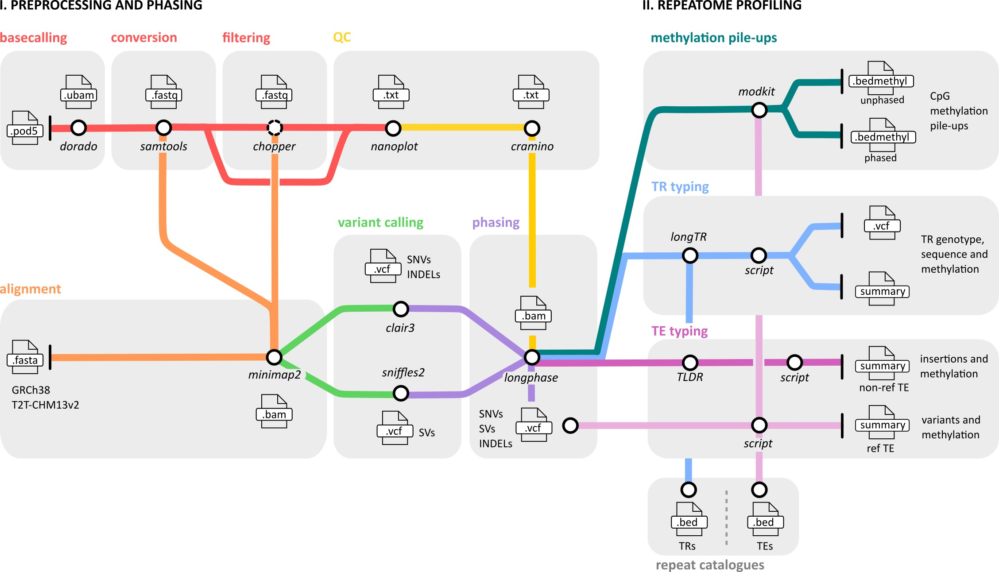

# ECHO: a nanopore sequencing-based workflow for (epi)genetic profiling of the human repeatome

---
## TABLE OF CONTENTS
- [Introduction](#introduction)
- [Pipeline overview](#pipeline-overview)
- [Setting up](#setting-up-the-pipeline)
  - [Installation](#installation)
  - [Input Files](#prepare-input-files)
  - [Set up configuration files](#Set-up-configuration-files)
  - [Configuration](#set-up-configuration-file)
- [Running the pipeline](#running-the-pipeline)
- [Citation](#citation)
- [Questions](#questions)

## INTRODUCTION

Repetitive DNA elements make up more than half of the human genome and include both tandem repeats (TRs) and transposable elements (TEs). These elements are highly polymorphic and tightly regulated by epigenetic mechanisms such as DNA methylation. They play key roles in genome regulation, evolution, and disease. However, their repetitive nature has made them difficult to analyze with short-read sequencing approaches.
Oxford Nanopore long-read sequencing provides the unique ability to span full-length repeat regions while simultaneously detecting native DNA methylation. This opens the door to comprehensive analyses of both the genetic and epigenetic landscape of the human repeatome in a single experiment.

Here we introduce **ECHO**, a comprehensive [Snakemake](https://snakemake.readthedocs.io/en/stable/)-based pipeline for the (**E**pi)genomic **C**haracterisation of **H**uman Repetitive Elements using **O**xford Nanopore Sequencing. It integrates state-of-the-art tools for QC, mapping, variant detection, phasing and methylation calling into a single reproducible workflow. With dedicated modules for both TR and TE analysis, ECHO enables joint profiling of sequence variation and CpG methylation across the full spectrum of repetitive elements. 

---

## PIPELINE OVERVIEW
### **Schematic overview**


For more information on all the tools used, see [`docs/tools.md`](docs/tools.md). 

---

## SETTING UP THE PIPELINE

Ensure the following are installed and available in your environment:

- Singularity (version ≥3.7 and <4.0, tested on 3.7.0)
- Snakemake (version ≥9.0, tested on 9.13.14)

### Installation
  
To install the ECHO pipeline, use:
```bash
git clone https://github.com/leenput/repeatome_pipeline.git # clone the repository
cd repeatome_pipeline
bash scripts/download_repeat_catalogs.sh # download the repeat catalogs in current directory
```

---
  
### **Prepare input files**  
To run the pipeline, ECHO accepts input files in one of the below formats. The chosen starting file format should be stored in a predefined directory in order to be detected by the pipeline. Based on your chosen starting file format, store it in the following path:

| Format  | Starting Directory                                                                    |
| ------- | --------------------------------------------------------------------------------- |
| `.pod5` | /path/to/projects/{project_name}/00_raw_data/pod5/{sample_name}/<your-file.pod5> |
| `.ubam` | /path/to/projects/{project_name}/00_raw_data/basecalled/ubam/{sample_name}/<your-file.bam>  |
| `.fastq` | /path/to/projects/{project_name}/00_raw_data/basecalled/fastq/{sample_name}/<your-file.fastq> |
| `.bam` (with index `.bai`)  | /path/to/projects/{project_name}/01_alignment/{sample_name}/GRCh38/<your-file.bam> and /path/to/projects/{project_name}/01_alignment/{sample_name}/GRCh38/<your-file.bam.bai> |

---

### ⚙️ Set up configuration files

ECHO uses **two independent configuration layers**:

| Layer | File | Purpose |
|---|---|---|
| **Pipeline configuration** | `configs/pipeline_config.yaml` | Defines *what* to analyse in the pipeline (inputs, parameters, references) |
| **Execution profile** | `profiles/*/config.yaml` | Defines *how* to run the pipeline on your system (local or HPC, resources, scheduler) |

> ✏️ **Only the pipeline configuration (`config/pipeline_config.yaml`) needs to be modified for each project.**

---

#### 1. Pipeline configuration

Before running the pipeline, you must generate a **project-specific pipeline configuration file** (`configs/pipeline_config.yaml`) for your analysis.

You can hard-code this file (you can find an example in `configs/pipeline_config.yaml`) or it is possible to **generated and validated** it using the provided helper script `scripts/make_config_tiny.py`. This script creates a valid Snakemake configuration for ECHO and ensures internal consistency between your input data, reference resources, and analysis settings.

The configuration defines:
- Sample IDs
- Input format (`.pod5`, `.ubam`, or `.bam`)
- Project input and output directories
- Reference genome (`GRCh38` or `T2T-CHM13v2`)
- TR and TE catalogs
- Key analysis parameters (e.g. flanking length, read filters)

##### Generating a minimal configuration

To quickly get started using the bundled ECHO repeat catalogs and sensible defaults, run:

```bash
python scripts/make_config_tiny.py init \
  --output configs/<config-name>.yaml \
  --samples SAMPLE1 SAMPLE2 \
  --start-from ubam \
  --input-dir /path/to/project \
  --output-dir /path/to/project \
  --reference /path/to/GRCh38.fa \
  --reference-name GRCh38 \
  --use-bundled-db
```

> 📄 For full configuration details and advanced usage, see [`docs/configuration.md`](docs/configuration.md)

##### Default settings (`--use-bundled-db` mode)

When `--use-bundled-db` is specified, ECHO applies the following defaults unless you explicitly override them:

| Category | Setting | Default value | Notes |
|---|---|---|---|
| Reference | Reference build | As specified by `--reference-name` | `GRCh38` or `T2T-CHM13v2` |
| TR analysis | TR catalog | Adotto genome-wide longTR | Sensitive, genome-wide TR catalog |
| TR analysis | TR type | `genome-wide` | Used for output folder naming |
| TR methylation | CpG filtering | Enabled | Restricts analysis to canonical STRs containing CpGs |
| TE analysis | TE catalog | Genome-wide (`all`) | All TE classes from UCSC RepeatMasker |
| Read filtering | Minimum read quality | 7 | Applied to FASTQ/UBAM inputs |
| Read filtering | Minimum read length | 500 bp | Shorter reads are discarded |
| Analysis | Flanking region length | 250 bp | Used for TR and TE analyses |
| Analysis | Repeat consensus extension | 1000 bp | Extension for repeat consensus building |

These defaults are designed to provide a **sensitive, genome-wide analysis** while keeping computational requirements manageable. All defaults can be overridden — see [`docs/configuration.md`](docs/configuration.md) for details.

---

#### 2. Execution profile

The execution profile controls **how Snakemake submits and manages jobs** on your compute environment (e.g. SLURM job scheduler and resource limits such as memory and CPUs). Pre-configured example profiles are provided in the `profiles/` directory.

Choose the profile that matches your environment:

| Environment | Profile directory |
|---|---|
| HPC cluster | `profiles/slurm_profile/` |
| Local (non-HPC) | `profiles/local_cph/` |

The provided HPC profile uses **SLURM** as the default scheduler. If you are using a different scheduler (e.g., PBS or LSF), you can modify the `executor` variable in the `config.yaml` file accordingly. Snakemake will automatically handle job submission based on the selected executor.

Snakemake (v9+) supports several executors, including:
- `slurm`
- `pbs`
- `lsf`
- `sge`
- `kubernetes`

Once you have chosen a profile, you need to make two changes:

##### Step 1 — Point the profile to your workflow config

Open `profiles/<your-profile>/config.yaml` and set the path to the workflow configuration file you generated in the previous step:

​```
configfile: /full/path/to/your/<config-name>.yaml
​```

##### Step 2 — Adjust cluster-specific settings

In the same profile `config.yaml`, adapt the settings to match your compute infrastructure. Key parameters to check include:

- **Singularity bind mounts** — ensure the project directory is accessible inside the container. Specify the path to the project directory in the `singularity-args` parameter in `profiles/HPC_profile/config.yaml`.

- **Default memory and runtime limits** — adjust these values to reflect typical job requirements and the resources available on your system.

---

## RUNNING THE PIPELINE
  
Run the workflow from the root directory of the repository (both in HPC or local environments):

```bash
snakemake --snakefile workflow/Snakefile --profile profiles/HPC_profile
```
Alternatively, if you are outside the project directory, provide the full path to the `Snakefile` and the profile directory

---

## REPEAT CATALOGS
 
For a detailed description of the repeat catalogs bundled with ECHO, or how to use custom catalogs, see  
📄 [`docs/repeat_catalogs.md`](docs/repeat_catalogs.md)

---

## OUTPUT FILES 

In your project folder, numerous output files are provided, with the most important ones explained [here](docs/output.md)

---

## TEST DATA

ADD

---
## CITATION

ADD

---

## QUESTIONS?

Please leave any feedback, issue or question on the [Issues section](https://github.com/leenput/repeatome_pipeline/issues).   
